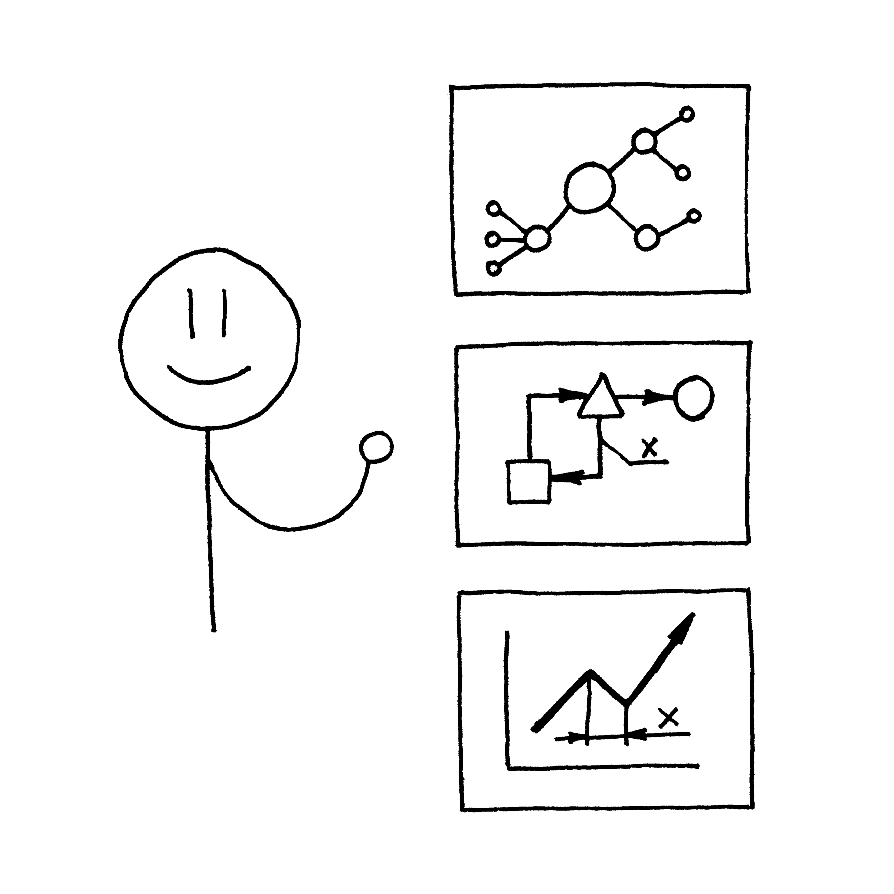

{:style="max-height: 80vmin; max-width: 80vmin"}

## Коротко

Визуальная информация --- ключ к успешному пониманию.  А где есть
понимание, есть эффективность, взаимодействие и сотрудничество.
Понимание пригодится для запоминания.  А память --- основа обучения.
Как учиться эффективно?  Как переработать информацию и понять ее?  Как
усвоить что-то новое, будь то иностранный язык или программирование?
Об этом и рассказывает этот курс.

## Для тех, кто хочет

- быстро и с удовольствием изучать новое, особенно иностранные языки
- эффективно и быстро обучать сложным концепциям с помощью простых
  схем
- извлекать самую суть и внутренние связи из длинных лекций и больших
  книг
- изображать и доносить свои мысли не только с помощью текста, но и
  графических образов

## Этот курс о том как

- найти подходящие инструменты, которые станут верными спутниками на
  пути графической мысли
- максимально использовать преимущества разных видов скетчей для
  максимальной эффективности
- применять скетчи для размышлений, обучения других, организации
  процессов и презентаций
- организовать хранение сотен скетчей, чтобы не тратить много времени
  на поиск нужного

## Курс содержит

- 15 глав в книге
- 15 скетчей
- 4 мозговых карты
- 3 чек листа

## К этому курсу подходят

- Мнемотехника
- Учить язык
- Концентрация

## Купить курс

Цена курса: 1990 ₽

Объем zip-архива курса: XX Мб.

[Демонстрационные материалы курса](/courses/sketches/demo.zip)

[Технические требования](/help/buy.html#computer)

[Скидки](/help/buy.html#discount)

[О приобретении курсов](/help/buy.html#buy)

[Форма для заказа](/feedback.html#order_courses)
